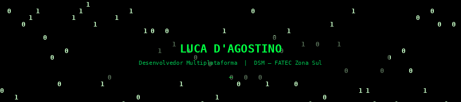
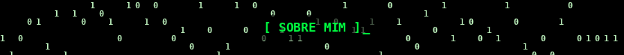
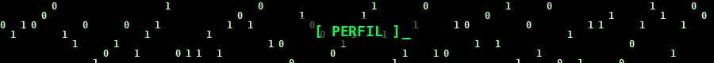
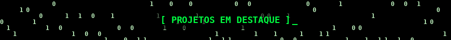
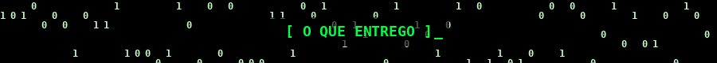
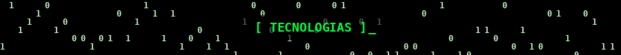
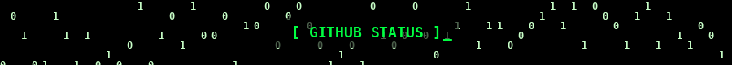
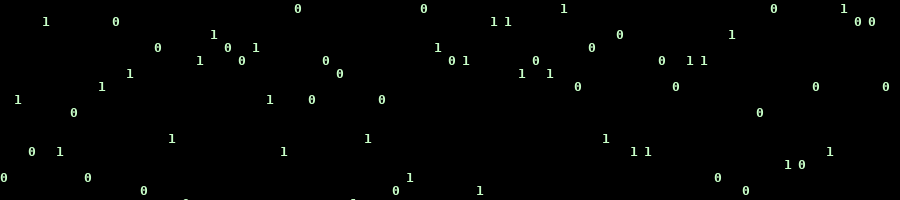
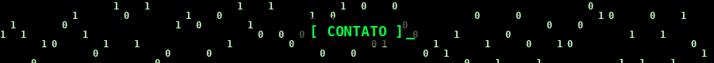

<!--
╔══════════════════════════════════════════════════════╗
║   README.md — Luca Simões D'Agostino (Luck16Ash)     ║
║   Tema Matrix · Fundo preto · Verde #00FF41           ║
╚══════════════════════════════════════════════════════╝
-->

<!-- ░░░░░░░░░░░░░░░ HERO — CHUVA MATRIX ░░░░░░░░░░░░░░░ -->

<!-- Hero Matrix com nome -->

 

<!-- Badges de localização / curso / status -->

---

<!-- ░░░░░░░░░░░░░░░ SOBRE MIM ░░░░░░░░░░░░░░░ -->

  

<table>
  <tr>
    <td>
      
       
      Estudante de <strong>Desenvolvimento de Software Multiplataforma</strong> na FATEC Zona Sul.  
      Meu foco está em <strong>transformar problemas reais em soluções funcionais</strong> — não em criar projetos genéricos para portfólio.  
      Cada projeto que você vai encontrar aqui nasceu de uma necessidade concreta: automatizar, organizar e simplificar processos que alguém dependia de cadernos, planilhas ou mensagens avulsas.  
      Atualmente buscando <strong>oportunidade de estágio</strong> em desenvolvimento web ou full-stack.
    </td>
  </tr>
</table>

---

<!-- ░░░░░░░░░░░░░░░ PRATELEIRAS ░░░░░░░░░░░░░░░ -->

  

| 🎓 Formação | 🎯 Objetivo | 💡 Abordagem |
|:-----------:|:-----------:|:------------:|
| DSM · FATEC Zona Sul | Estágio em dev web / full-stack | Problema → Solução → Entrega |
| 4º semestre · Conclusão 2027 | Soluções com impacto real | Código orientado a propósito |

---

<!-- ░░░░░░░░░░░░░░░ PROJETOS EM DESTAQUE ░░░░░░░░░░░░░░░ -->

  

<table>
  <tr>
    <!-- InteliBolsas -->
    <td width="50%" valign="top">
      <h3 align="center">🎓 InteliBolsas</h3>
      

        
      

      
<strong>Sistema acadêmico de gestão e divulgação de bolsas de estudo.</strong>

      

        <strong>🎯 Problema:</strong> Informações de bolsas dispersas, sem estrutura de acesso por perfil. 
        <strong>✅ Solução:</strong> CRUD com separação de perfis (admin, estudante, instituição), filtros e banco relacional. 
        <strong>💡 Impacto:</strong> Centralização e consulta estruturada de oportunidades.
      

      

        
        
        
        
        
      

      

      

        <strong>Soft-skills evidenciadas:</strong> 
        Modelagem de dados · Separação de responsabilidades · Raciocínio de perfis de acesso
      

    </td>
    <!-- Studio Patty Leão — contribuidor -->
    <td width="50%" valign="top">
      <h3 align="center">💇 Studio Patty Leão</h3>
      

        
      

      

        
      

      
<strong>ERP web para salão de beleza — sistema em produção.</strong>

      

        <strong>🎯 Problema:</strong> Controles fragmentados em cadernos, planilhas e mensagens avulsas. 
        <strong>✅ Solução:</strong> Plataforma unificada com agendamentos, agenda profissional, estoque, financeiro e BI básico. 
        <strong>💡 Impacto:</strong> Visão centralizada da operação do salão, com suporte real à gestão.
      

      

        
        
        
        
        
      

      

      

        <strong>Soft-skills evidenciadas:</strong> 
        Visão de produto · Empatia com usuário real · Entrega em ambiente de produção
      

    </td>
  </tr>
</table>

---

<!-- ░░░░░░░░░░░░░░░ O QUE ENTREGO ░░░░░░░░░░░░░░░ -->

  

| 🧠 Leitura do problema | ⚙️ Entrega estruturada | 🤝 Empatia com usuário | 📚 Aprendizado contínuo |
|:----------------------:|:----------------------:|:----------------------:|:------------------------:|
| Entendo antes de codar. Meus projetos nasceram de necessidades reais, não de tutoriais. | Separo responsabilidades e organizo o fluxo antes de abrir o editor. | Projetos feitos para pessoas reais. Usabilidade como critério de aceite. | De PHP + MySQL a Node + MongoDB em um semestre. Adaptação deliberada. |

---

<!-- ░░░░░░░░░░░░░░░ STACKS ANIMADAS ░░░░░░░░░░░░░░░ -->

  

<table width="100%">
  <tr>
    <td align="center" width="25%" style="border:1px solid #003300; background:#000; padding:16px">
      

       
      
    </td>
    <td align="center" width="25%" style="border:1px solid #003300; background:#000; padding:16px">
      

       
      
    </td>
    <td align="center" width="25%" style="border:1px solid #003300; background:#000; padding:16px">
      

       
      
    </td>
    <td align="center" width="25%" style="border:1px solid #003300; background:#000; padding:16px">
      

       
      
    </td>
  </tr>
</table>

---

<!-- ░░░░░░░░░░░░░░░ GITHUB STATS ░░░░░░░░░░░░░░░ -->

  

  

---

<!-- ░░░░░░░░░░░░░░░ CONTATOS ░░░░░░░░░░░░░░░ -->

  

<!-- FOOTER MATRIX — abaixo dos contatos -->

  

<!--
╔══════════════════════════════════════════════════════════════╗
║  CHECKLIST DE SETUP — leia antes de publicar                 ║
╠══════════════════════════════════════════════════════════════╣
║  1. Crie o repositório: github.com/Luck16Ash/Luck16Ash       ║
║     (nome idêntico ao seu usuário)                           ║
║  2. Suba AMBOS os arquivos na raiz do repositório:           ║
║     - README.md                                              ║
║     - matrix.html  ← página da animação (GitHub Pages)      ║
║  3. Verifique se skillicons.dev carregou todos os ícones     ║
╚══════════════════════════════════════════════════════════════╝
-->
