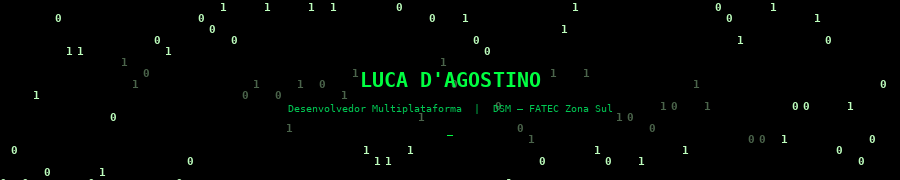
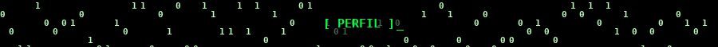
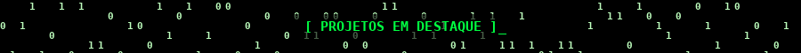
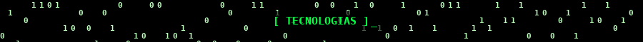
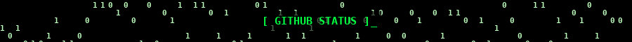
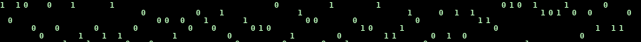
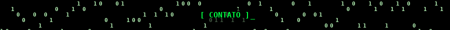

<!--
╔══════════════════════════════════════════════════════╗
║   README.md — Luca Simões D'Agostino (Luck16Ash)     ║
║   Tema Matrix · Fundo preto · Verde #00FF41          ║
╚══════════════════════════════════════════════════════╝
-->

<!-- ═══════════════════════════════════════════════════ -->

<!-- HERO                                                -->

<!-- ═══════════════════════════════════════════════════ -->

<div align="center">



<br/>


</div>

---

<!-- ═══════════════════════════════════════════════════ -->

<!-- PERFIL                                              -->

<!-- ═══════════════════════════════════════════════════ -->

<div align="center">
  
</div>

<div align="center">

|          🎓 Formação         |                      🎯 Objetivo                      |         💡 Abordagem         |
| :--------------------------: | :---------------------------------------------------: | :--------------------------: |
|     DSM · FATEC Zona Sul     | Estágio em Back-end / Full-stack ou Dados & Analytics | Problema → Solução → Entrega |
| 4º semestre · Conclusão 2027 |               Soluções com impacto real               | Código orientado a propósito |

</div>

---

<!-- ═══════════════════════════════════════════════════ -->

<!-- PROJETOS                                            -->

<!-- ═══════════════════════════════════════════════════ -->

<div align="center">
  
</div>

<table>
  <tr>

```
<!-- INTELIBOLSAS -->
<td width="50%" valign="top">

  <h3 align="center">🎓 InteliBolsas</h3>

  <p align="center">
    <a href="https://github.com/Luck16Ash/InteliBolsas">
      
    </a>
  </p>

  <p>
    <strong>Sistema acadêmico de gestão e divulgação de bolsas de estudo.</strong>
  </p>

  <p>
    <strong>🎯 Problema:</strong>
    Informações de bolsas dispersas, sem estrutura de acesso por perfil.
    <br/><br/>

    <strong>✅ Solução:</strong>
    CRUD com separação de perfis (admin, estudante e instituição),
    filtros e banco de dados relacional.
    <br/><br/>

    <strong>💡 Impacto:</strong>
    Centralização e consulta estruturada de oportunidades.
  </p>

  <p align="center">

    

    

    

    

    

  </p>

  <hr/>

  <p align="center">
    <strong>Competências evidenciadas</strong><br/>
    Modelagem de dados · Separação de responsabilidades · Perfis de acesso
  </p>

  <p align="center">
    <a href="https://github.com/Luck16Ash/InteliBolsas">
      
    </a>
  </p>

</td>

<!-- STUDIO PATTY LEÃO -->
<td width="50%" valign="top">

  <h3 align="center">💇 Studio Patty Leão</h3>

  <p align="center">
    <a href="https://github.com/maxgodoydev-dotcom/studio-patty-leao">
      
    </a>
  </p>

  <p align="center">
    
  </p>

  <p>
    <strong>ERP web para salão de beleza — sistema em produção.</strong>
  </p>

  <p>
    <strong>🎯 Problema:</strong>
    Controles fragmentados em cadernos, planilhas e mensagens avulsas.
    <br/><br/>

    <strong>✅ Solução:</strong>
    Plataforma unificada com agendamentos, agenda profissional,
    estoque, financeiro e BI básico.
    <br/><br/>

    <strong>💡 Impacto:</strong>
    Visão centralizada da operação do salão, com suporte real à gestão.
  </p>

  <p align="center">

    

    

    

    

    

  </p>

  <hr/>

  <p align="center">
    <strong>Competências evidenciadas</strong><br/>
    Visão de produto · Empatia com usuário real · Entrega em produção
  </p>

  <p align="center">

    <a href="https://studio-patty-leao.onrender.com">
      
    </a>

    &nbsp;

    <a href="https://github.com/maxgodoydev-dotcom/studio-patty-leao">
      
    </a>

  </p>

</td>
```

  </tr>
</table>

---

<!-- ═══════════════════════════════════════════════════ -->

<!-- TECNOLOGIAS                                         -->

<!-- ═══════════════════════════════════════════════════ -->

<div align="center">



</div>

<table width="100%">

<tr>

<td align="center" width="25%">

<strong>LINGUAGENS</strong>

<br/><br/>


</td>

<td align="center" width="25%">

<strong>BACK-END & BD</strong>

<br/><br/>


</td>

<td align="center" width="25%">

<strong>FRAMEWORKS & UI</strong>

<br/><br/>


</td>

<td align="center" width="25%">

<strong>FERRAMENTAS</strong>

<br/><br/>


</td>

</tr>

</table>

---

<!-- ═══════════════════════════════════════════════════ -->

<!-- GITHUB                                               -->

<!-- ═══════════════════════════════════════════════════ -->

<div align="center">



<br/>

<a href="https://github.com/Luck16Ash">


</a>

<a href="https://github.com/Luck16Ash">


</a>

</div>

<br/>

<div align="center">



</div>

<br/>

<div align="center">


</div>

---

<!-- ═══════════════════════════════════════════════════ -->

<!-- CONTATO                                             -->

<!-- ═══════════════════════════════════════════════════ -->

<div align="center">



<br/>

<a href="https://www.linkedin.com/in/luca-d-agostino-a0061130b/">


</a>

<a href="mailto:ldagostino592@gmail.com">


</a>

<a href="https://github.com/Luck16Ash">


</a>

</div>

<br/>

<div align="center">


</div>
